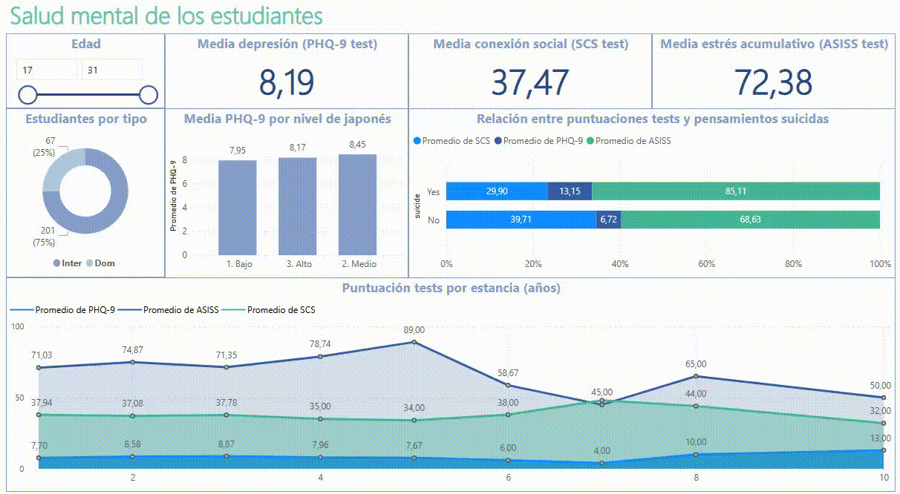

# Salud Mental en Estudiantes

Este proyecto analiza variables relacionadas con la salud mental en estudiantes internacionales, utilizando Power BI para visualizar datos como niveles de depresión (PHQ-9), estrés por aculturación (ASIS), conectividad social (SCS), dominio de idiomas, y otros factores.

## 📊 Herramientas utilizadas
- Power BI
- Excel/CSV
- PostgreSQL

## 📁 Archivos del proyecto
- `pbit/salud_mental.pbit`: archivo original del dashboard.
- `data/students.csv`: dataset usado para crear el dashboard (si puede compartirse).
- `images/salud_mental_demo.gif`: interacción del dashboard.
- `images/salud_mental.pdf`: vista previa del dashboard.
- `pbit/salud_mental.pbit`: archivo de Power BI.

## 📌 Objetivos del Análisis
- Identificar posibles relaciones entre el dominio del idioma y los niveles de estrés o depresión.
- Visualizar cómo varía el bienestar emocional según el tipo de estudiante o el tiempo de estancia.
- Generar insights para instituciones educativas o departamentos de bienestar.

## 🚀 Cómo abrir el proyecto
1. Descarga el archivo `.pbit` de la carpeta `pbit/`.
2. Ábrelo en Power BI Desktop.

## Contacto

Si tienes preguntas o sugerencias, no dudes en contactarme a través de [LinkedIn](http://www.linkedin.com/in/eugarciadata) o eugeniogarciacm@gmail.com.